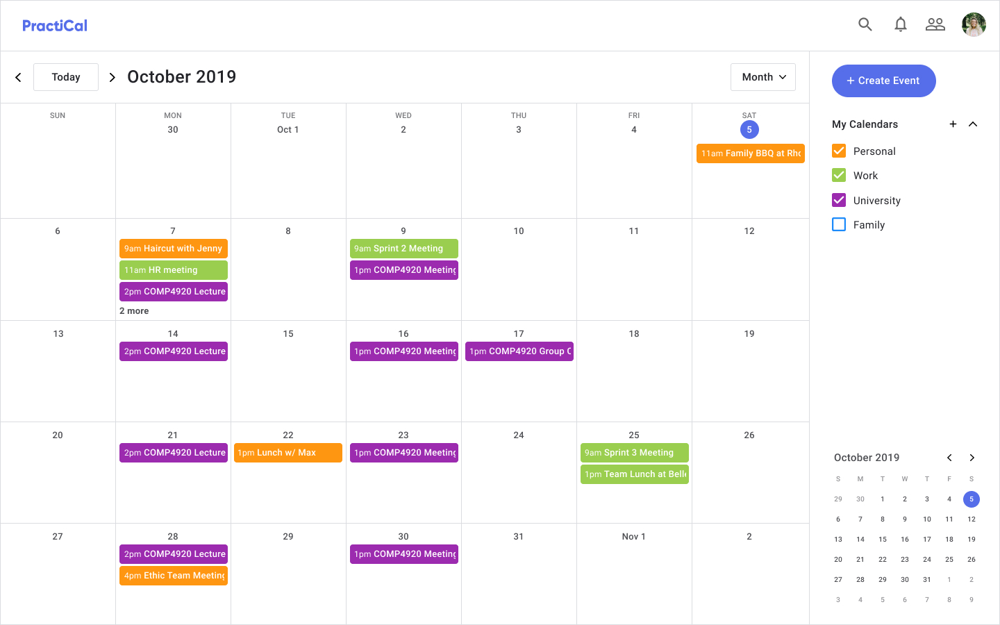

# PractiCal
Calendar application with Natural Language Processing for event creation.



## Database Setup Instructions
1. Install MySQL server. Instructions on how to do so can be found at:
</br>https://dev.mysql.com/doc/mysql-installation-excerpt/5.5/en/installing.html

2. Create a new user by logging into mysql as root user and run the following
commands:
```
CREATE USER 'admin'@'localhost' IDENTIFIED BY 'password';
GRANT ALL PRIVILEGES ON *.* TO 'username'@'localhost';
```

## Setup Instructions
1. Activate virtual environment
```
source venv/bin/activate
```
2. Add Google credentials
```
export GOOGLE_APPLICATION_CREDENTIALS=./googlekey.json
```
3. Install requirements
```
pip3 install -r requirements.txt
```
4. Navigate to **static folder** and install npm dependencies
```
npm install
```
5. Start the development watch server from the static folder
```
npm run watch
```
If you get an error here similar to **npm WARN babel-loader@8.0.2 requires a peer of @babel/core@⁷.0.0 but none was installed.**, then you should downgrade your babel-loader to 7.x as follows:
```
npm install babel-loader@^7 --save-dev
```
6. Initialise Database by running in the templates/code directory and following the prompts
```
python3 DatabaseManager.py
```

7. Open a terminal at the root directory and start the python server
```
python3 run.py
```
8. If you recieve error messages involving material-ui, run
```
npm install --save --save-dev @material-ui/core
```
9. Login with the following username and password
```
username: zainab.a@email.com
password: password
```
